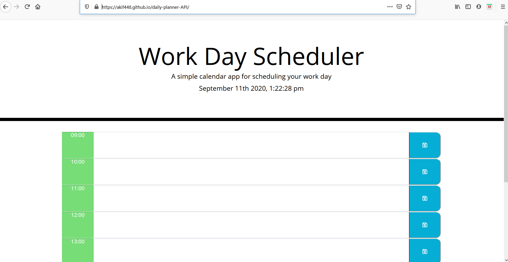

# daily-planner-API
<<<<<<< HEAD

=======
A simple daily planner/calendar application that allows the user to save events for each hour of the day. This app will run in the browser and feature dynamically updated HTML and CSS powered by jQuery and momeny.js library.

Using bootstrap and fontawsome libraries a layout is generated in hour blocks representing buisness hours. (0900 - 1700) hours. The user can edit and save text inputs into each hour time-block field. Depending on the live time (generatted by moment.js) the time portion of the block (left hand side) will indicate eather grey for past, red for present and green for future.

link to repo: https://github.com/Akif448/daily-planner-API
link to live site: https://akif448.github.io/daily-planner-API/

>>>>>>> 14f4c5f6ec38a5a2ea65d0930c7ee00deb2d2d77
